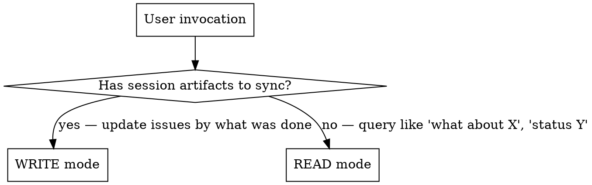
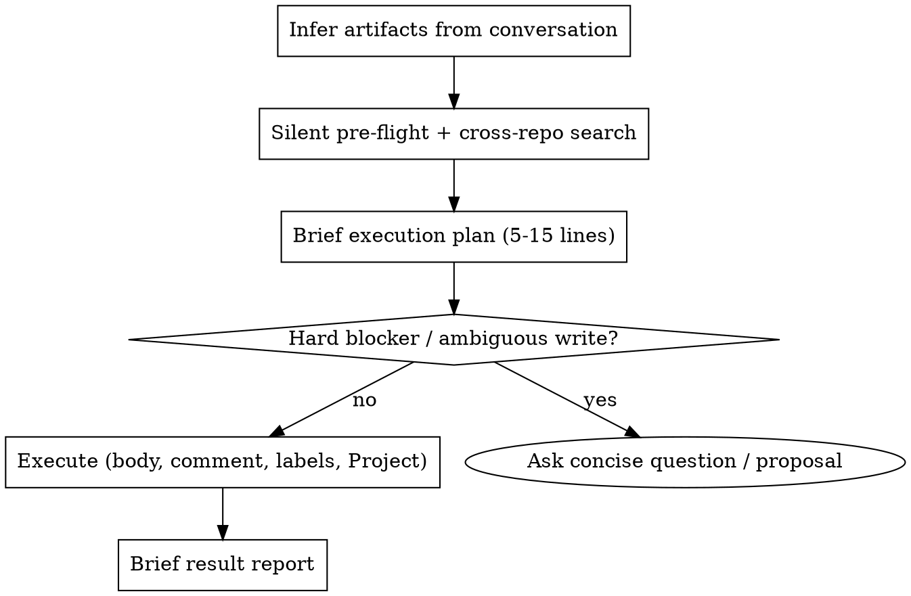

# Manager — bidirectional GitHub issues bridge

Part of the Personal Corp framework — running a one-person business through AI agents.

Bridges session work and GitHub issues in both directions. GitHub issues are the source of truth for tasks; a GitHub Project board is the source of truth for what's active. Manager has two modes:

1. **Write mode (sync)** — at end of session: read what was done, find existing issues, update with progress + a work-record comment, keep parent / W-label / Project invariants, create new only if nothing matches.
2. **Read mode (query)** — anytime: «what about track X?», «status of Y?» → search across your repos, return condensed state of matching issues with parent epic, labels, Project placement, and last activity.

**Manager is the canonical issue workflow.** Do not fall back to a generic issue helper for these operations — manager owns the read-modify-write contract, the invariants, and the Project sync.

## Setup

Before first use, define this in your project's `CLAUDE.md`:

```markdown
## Manager Config

### GitHub owner
Your GitHub username or org for issue search:
- owner: your-github-handle

### Repos to scan (cross-repo issue search scope)
List repos manager should search:
- ~/Projects/main
- ~/Projects/ops
- ~/Projects/marketing

### Tasks index file (optional)
Path to your curated "what's hot this week" file. Manager reads it FIRST before any `gh search` to scope queries:
- tasks_index: ~/docs/tasks.md
(если файла нет — manager работает без индекса, поиск идёт по всем repos)

### Domain → repo routing
| Domain | Repo |
|--------|------|
| commercial / B2B deals | crm |
| product launches | main |
| ops / infrastructure | ops |
| content | marketing |

### GitHub Projects integration
Manager treats Project placement as an invariant (see Iron invariants). Declare your boards:
- weekly_project: <number>          # cross-repo "everything active this week" board
- weekly_project_owner: your-github-handle
- status_field: Status              # the single-select field that holds the lane
- status_in_progress: In progress   # option name (or id) for the active lane
- domain_projects (optional):       # per-domain boards, if you keep them
    | Domain | Project number |
    | commercial | <number> |
    | product | <number> |

Cache resolved field/option IDs here once discovered (`gh project field-list <N> --owner OWNER --format json`) so manager doesn't re-fetch them every run.

### W-label convention (optional)
- enabled: true
- format: W{NN} (ISO week)
(если false — manager создаёт issues без weekly labels)

### Standing write authorization
- mode: ask-each-time | execute-after-plan
(default: ask. execute-after-plan = manager executes writes after showing the brief plan, without separate confirmation)

### CRM integration (optional)
- crm_path: ~/Projects/crm
- crm_pointer_format: [[<slug>]]
(если не используется — секция игнорируется; см. CRM integration ниже)
```

No separate init skill needed — this section is the setup. Title-type metadata is NOT configured here: it lives in labels, the parent tree, and Projects (see Issue title convention).

## Iron invariants

Every issue manager touches MUST satisfy the base three; an active / current-week issue must additionally satisfy the Project and work-record invariants:

1. **W-label** (current or future week, or the date of a specific dated event) — if W-label convention enabled in config. If the label doesn't exist in the repo — create it.
2. **Parent epic** — exactly one parent via GitHub Sub-issues API. Any issue that isn't itself an epic must have a parent. See "Parent epic rules" below.
3. **Track differentiation via title + epic membership** — no track-labels (`<track-slug>`, `<client>-deal`). Track is recognized by title text and epic membership.
4. **Project placement** — an active / current-week issue must be present on its domain Project board (if you keep one) AND on the global weekly Project. A W-label without Project placement = `Project drift`.
5. **Project-visible parent** — for an active / current-week child, one `parent_issue_url` is not enough. The visible root epic must itself be in the relevant Project view with a non-empty status lane.
6. **Work-record comment** — in write mode, only when REAL work happened on the issue this session: a mandatory timeline comment summarizing what was done + commit links. Changing status / label / Project placement does NOT replace it. Pure mechanical re-label / Project-fix with no content work = no comment.

Without these — the issue isn't tracked correctly. If no parent epic exists in any repo — manager raises this in proposal and offers to create or pick an existing one, **before** sync. Never leaves orphan issues.

## Mode resolution



**Signal for write mode:** user said «sync session», «зафиксируй», «обнови issues», OR invoked `/manager` without args at end of session, OR explicitly listed artifacts/changes.

**Signal for read mode:** user asked a question about state — «what about», «status», «есть ли», «какие issues по».

**Bare `/manager` invocation:** infer artifacts from current conversation context — what tracks were touched, what files were modified/created, what decisions were made. Do NOT ask user to re-list everything. Form brief execution plan (5-15 lines), then execute under the configured authorization mode.

**Do NOT use manager for:** creating ideas without artifacts (that's brainstorming); closing an issue without explicit user instruction; batch CRM updates (that's a CRM skill, not manager).

## Output language

Output language matches the user's input language and project conventions. Technical tokens remain as-is and are not translated: issue names (`<repo>#<N>`), labels (`W18`, `retro:W17`, `backlog`), commands (`gh issue comment`), file paths, original English titles of issues in quotes.

### Issue-title language

New issue titles (and renamed titles) follow the user's locale — match the language convention of the project. English is allowed only as a proper noun: product name, repo name, brand, API name, public upstream term (`GitHub`, `Telegram`, `LMS`, `PRD`, `E2E`). English action verbs and generic filler phrases in titles are forbidden:

- ❌ `delivery track`, `launch/funnel`, `follow-up`, `workshop prep`, `handoff`, `rollout package`, `topic TBD`, `date TBD` (as English filler when the project language is not English)

All narrative elements in issue titles, body headers, and proposal text follow the project's locale. Technical tokens (`repo#N`, label names, CLI commands, file paths, quoted original titles of existing issues) stay as-is.

## Sources of truth (read every run)

1. **`$TASKS_INDEX_PATH`** (if configured) — current week index. Source for: what's hot this week, what tracks are active, repo pointers for each track. Read FIRST to frame the session.
2. **GitHub issues across `$YOUR_OWNER/*`** — authoritative for individual tasks. Search via `gh search issues --owner $YOUR_OWNER` or batched GraphQL (see below).
3. **GitHub Project board(s)** — authoritative for what's active this week and in which lane.
4. **CRM artifacts** (if CRM integration enabled in config) — meeting cards, opportunity cards, person cards. NOT a substitute for a GH issue, but the linkage anchor: every comm-related issue body must include a CRM pointer.

## When to use vs when NOT

**Use (write mode):**
- User says "sync session" / "/manager" / "обнови issues по тому что сделал"
- End of working session with concrete artifacts (CRM updates, meeting cards, code commits, docs)

**Use (read mode):**
- Start or middle of session — user asks «what about <track>», «status», «is there an issue for»
- Need cross-repo state of a track without manually grepping
- Before deciding next step — check what's already open

**Do NOT use:**
- For creating new ideas without artifacts — use brainstorming
- For closing issues without explicit user instruction (see Common mistakes)

## Pre-flight (both modes) — HARD PRECONDITION

Pre-flight MUST run before any `gh search`, `gh issue`, or other GH command. No exceptions.

Keep pre-flight silent and minimal. Do not dump tasks index content, full git status, or label catalogues into chat. Read what you need internally, surface only what changes the proposal. **Output budget for pre-flight: 0 lines.**

1. **Read `$TASKS_INDEX_PATH` FIRST** (if configured). This is the curated index of current-week priorities + active tracks + repo pointers. Without it, search is shotgun (random keywords) instead of targeted.
2. **Snapshot the weekly Project once per run** with an explicit high limit (the default page truncates large boards):
   ```bash
   gh project item-list <WEEKLY_PROJECT> --owner $YOUR_OWNER --format json --limit 1000 > /tmp/manager-proj.json
   ```
3. **Task drift guard.** If the current day or week plan contains an active task row with no `repo#N` GitHub issue reference → surface as `Task drift: <row> — no GitHub issue`. In read mode: report only. In write mode: find an existing issue or create one (then it carries the iron invariants). Manager does not rewrite the tasks index itself — index curation is the `weekly-planning` skill's job.
4. Check git status of relevant repos (silently). If specific artifacts referenced in session are uncommitted, mention only those by name in proposal.
5. Compute current ISO week if tasks index "Updated" line is stale (>7 days) or absent.

**Run independent `gh` reads in parallel** — multiple Bash calls in a single message. Run sequentially only when the output of one call is required as input for the next.

### Red flag: skipping tasks index

If you're about to run `gh search issues` without first reading `$TASKS_INDEX_PATH` (when configured) — STOP. You're about to do shotgun search instead of using the Project/track index that already exists.

## Write mode algorithm



In write mode, for each touched issue:

1. Update the **body** (default channel — not a comment): refresh `Status` / `Next` + a dated entry in `## Updates`.
2. Add the **work-record comment** (Iron invariant 6) — only if real work happened: what was done this session + `refs`/SHA.
3. Ensure **W-label + parent (Sub-issues API) + Project placement**, and set the Project status lane to `In progress` (see Project status sync).
4. Record **commit↔issue linkage** (see below).

**Authorization mode** (from your CLAUDE.md config):

- `ask-each-time` (default): after the plan, ask "execute?" before any GitHub write.
- `execute-after-plan`: after the silent pre-flight and brief execution plan, execute scoped GitHub writes without asking a separate confirmation. Still run pre-flight, search existing issues, preserve invariants, and report exactly what changed.

Either mode: ask before writing when the write is genuinely ambiguous or risky — no suitable parent epic, uncertain repo/track ownership, public-repo privacy risk, destructive/bulk changes, closing an issue whose scope is not clearly completed, or conflicting evidence.

### Commit ↔ issue linkage

1. Every commit in a session should carry a trailer: `refs $YOUR_OWNER/<repo>#N` (or `closes $YOUR_OWNER/<repo>#N` if the commit fully closes the scope). GitHub shows a backlink in the issue timeline — works cross-repo.
2. The dated entry in `## Updates` lists short SHAs of commits from each touched repo this session: `(code: <repo-A>@9a8ff92, <repo-B>@6fb5b26)`. An issue with no SHA when commits exist = incomplete sync.
3. Collect SHAs via `git log --oneline -10` per touched repo before writing the Updates entry.
4. **Artifact must be committed and pushed BEFORE being linked.** The user reads everything via web GitHub — an uncommitted local file does not exist for them. Links in body/report must be clickable GitHub URLs, not `~/...` local paths.

### Planning artifacts (PRD / plans / diagrams)

When a session produces a PRD, plan, or diagram: the full content belongs in the **issue body** — context, decision table, mermaid diagrams (GitHub renders them inline), schema, MVP slices, out-of-scope, open questions — not a link to a file. A local md file can exist as a working copy; if they diverge, the issue body is the source of truth. Any file link from the body is a clickable GitHub URL pointing to an already-committed-and-pushed version, never a local path.

## Read mode algorithm

1. Resolve query subject — track name, person, repo, issue number, time window.
2. Run cross-repo search (multi-key) — single `gh search issues` for simple tracks, batched GraphQL for 3+ keys (see below).
3. **Filter false-positives** — drop matches where keyword overlap is incidental (e.g. issue tagged `W18` but unrelated to the queried track). See "False-positive surface" below.
4. For true matches, pull live state in one batched GraphQL call: title, state, labels, parent (Sub-issues API), `projectItems` with status lane, last activity. Prose is not evidence — use live reads.
5. **Resolve track epic** — find the parent epic. Pull `sub_issues_summary` — note `total`, `completed`, `percent_completed` + epic's own `state`.
6. Cross-reference tasks index — does the track appear in the current-week priority list? If yes, mark as "🔥 hot W{NN}". Verify the index row for drift: referenced issue CLOSED, scope mismatch, or implied open work that no longer exists.
7. Output: condensed table (with a Project column) + open questions + "what's NOT covered yet" gaps + drift surface. Read mode never writes to GitHub.

### Live Project state reads — batched GraphQL

When surfacing or correcting Project placement, batch up to ~20 issues in one GraphQL call via aliases:

```bash
gh api graphql -f query='
query {
  i1: repository(owner:"$YOUR_OWNER", name:"<repo1>") { issue(number:<N1>) { ...IssueState } }
  i2: repository(owner:"$YOUR_OWNER", name:"<repo2>") { issue(number:<N2>) { ...IssueState } }
}
fragment IssueState on Issue {
  number title state url
  labels(first:20){nodes{name}}
  parent { number title repository { nameWithOwner } }
  projectItems(first:10){nodes{ id project { number title } fieldValueByName(name:"Status"){ ... on ProjectV2ItemFieldSingleSelectValue { name } } }}
}' --jq '.data | to_entries[] | .value.issue | select(. != null)
  | "\(.number) \(.title) [\([.labels.nodes[].name]|join(","))] parent=\(.parent.repository.nameWithOwner // "—")#\(.parent.number // "") projects=\([(.projectItems.nodes // [])[] | "\(.project.title):\(.fieldValueByName.name // "empty")"]|join(" | "))"'
```

Notes: `parent` is the Sub-issues API parent; `projectItems[].fieldValueByName.name` is the status lane. Result is at `.data.<alias>.issue` — don't forget the `.issue` level in jq. Single-issue fallback: `gh issue view N -R $YOUR_OWNER/<repo> --json projectItems` — `.projectItems[].status` is an object; read `.status.name`, not `.status`. List epic children: `gh api repos/$YOUR_OWNER/<repo>/issues/<EPIC_N>/sub_issues --jq '.[] | {number, title, repository_url}'`.

### Parent-proof ambiguity

When verifying parent visibility: check both the child's `parent_issue_url` AND the parent's `/sub_issues` endpoint. If child-side parent reads as `null` but parent `/sub_issues` lists the child, report `parent proof: parent sub_issues ✓; child API ambiguous` — not `parent missing`. The two API surfaces can disagree transiently.

### Related context, not hierarchy

Build a `Related` context list only for true matches with a distinct scope: a separate task, contextual reference, dependency, cross-repo artifact, or historical task. Filter out parent/child links already expressed through the Sub-issues API — those are already visible in the hierarchy column. Do not duplicate API-expressed structure as `Related` prose.

## Search for existing issues — how

For each artifact or query subject, search by **multiple keys** to avoid missing matches. For simple unambiguous tracks (single-keyword) one query is enough — escalate to multi-key only when first query returns 0 or 5+ matches:

```bash
gh search issues --owner $YOUR_OWNER --state open <key> --json repository,number,title,labels,updatedAt
```

**Keys to try (per artifact/subject):**
- Person name + slug (different transliterations): `"<person-name>"`, `<handle>`, `<filename-slug>`
- Company / track: `<track-A>`, `<track-B>`, `<client>`
- Telegram/social handle if mentioned: `<handle>`
- Filename slug from any CRM artifact: `<opportunity-slug>`

**Match acceptance criterion:** issue title or body references the same person/company/track AND scope of work overlaps. If 2+ candidates match — pick the most specific one and link the others as `Related`.

### Batched GraphQL search (3+ keys)

When multi-key search needs 3 or more queries, batch them in a single GraphQL call to avoid the REST Search API rate limit (30 req/min):

```bash
gh api graphql -f query='
query {
  s1: search(query:"user:$YOUR_OWNER is:issue state:open <term1>", type:ISSUE, first:10){ nodes { ... on Issue { number title url repository{nameWithOwner} labels(first:10){nodes{name}} updatedAt } } }
  s2: search(query:"user:$YOUR_OWNER is:issue state:open <term2>", type:ISSUE, first:10){ nodes { ... on Issue { number title url repository{nameWithOwner} labels(first:10){nodes{name}} } } }
}' --jq '.data | to_entries[] | .key as $k | (.value.nodes // [])[] | select(.number != null)
  | "\($k) \(.repository.nameWithOwner)#\(.number) \(.title) [\([(.labels.nodes // [])[].name]|join(","))]"'
```

**Required jq guards** (without them, the batch crashes on `cannot iterate over: null`):
- `(.value.nodes // [])` and `(.labels.nodes // [])` — an alias or field can return `null`
- `select(.number != null)` — drops empty `{}` objects from non-Issue nodes
- `is:issue` in each query string — excludes PRs

**Partial errors:** `gh api graphql` may exit with code 1 while printing valid results for live aliases. Do not treat the whole batch as broken. Read `.errors`, drop/fix the failed alias, use the rest.

**Why:** `gh search issues` is the REST Search API, limited to 30 req/min — multi-key runs of 15-20 searches throttle. GraphQL `search()` counts against the 5000 points/hour GraphQL limit and batches efficiently. Owner qualifier in GraphQL is `user:$YOUR_OWNER` (not `--owner`).

## False-positive surface (read AND write mode)

Search by W-label or generic terms can return issues that **share a label but aren't on this track**. Example: `<repo>#1` returned for `<track-A>` query because both have `W18` label.

**Rule:** if a search match's title/body has no overlap with the queried track besides W-label or other generic label — it's a false positive. Drop it from results, surface in report under `IGNORED (false positives)` so user can confirm.

```
IGNORED (false positives):
- <repo>#1 — surfaced via W18 label match, but track = <unrelated track>
```

Don't silently filter — show what was filtered and why, in case user spots a real link manager missed.

## Parent epic rules

Every issue (except the epic itself) must have **exactly one** parent via GitHub Sub-issues API. This is machine-readable track differentiation — replaces track-labels and stale markdown pointers in body.

### What counts as an epic

- An issue that has sub-issues (counter `N / M` shown at top)
- Title typically contains track scope (`<program>: <partner> — overview`, `<deal> — overview`, `<product> — delivery <version>`)
- An epic itself does NOT have a parent — it's the root of the tree
- A working epic typically has `total >= 1`, but a new root issue with a clear track scope may be proposed and used as an epic before its first sub-issue, provided the user confirms the scope (bootstrapping a new track).

### One epic per issue

GitHub supports only one parent via Sub-issues API. This matches: «one track — one hierarchy». If a task seems to relate to two tracks — reconsider scope: probably split into two issues, OR it's an aggregate issue (see below).

Do not use markdown `Parent: #N`, `Epic: #N`, `Belongs to: #N` in body when parent is set via API — it's a duplicate that goes stale. Parent is stored via the Sub-issues API only.

### Resolve epic — algorithm at creation / sync

1. **Search for an existing epic** for the track via cross-repo search; verify candidates have non-empty `sub_issues_summary.total`.
2. **Canonical mapping by domain** (configure per your business in `Domain → repo routing`):

   | Track domain | Epic lives in |
   |--------------|---------------|
   | Educational program / partnership | teaching domain repo |
   | B2B deal / multi-lane commercial track | crm / commercial repo |
   | Product launch | the product's own repo |
   | Research initiative | research repo |

3. **If no epic exists** — manager raises in proposal: «no epic for track X, do you want one?». Never creates an issue without a parent silently.
4. **When creating a sub-issue** via API:

   ```bash
   CHILD_ID=$(gh api repos/OWNER/REPO/issues/CHILD_NUMBER --jq '.id')
   gh api -X POST repos/EPIC_OWNER/EPIC_REPO/issues/EPIC_NUMBER/sub_issues -F sub_issue_id=$CHILD_ID
   ```

### Aggregate parent for cross-track issues

If an issue covers 2+ sibling tracks, scopes, or deliverable classes, classify it as an **aggregate issue** before assigning a parent. Do not attach it to the first matching subject epic if that would make another sibling scope invisible.

**Signals of an aggregate issue:**
- Title/body explicitly spans multiple sibling scopes: `product + sales`, `strategy + delivery`, `pilot + docs`, `launch + ops`.
- Issue lives in an aggregate/reporting repo while the subject epics live in their owner repos.
- Body talks about weekly review, close/kill decision, forecast, pipeline, operating review, portfolio snapshot, or cross-repo coordination.
- Issue updates a shared index, forecast, heartbeat, dashboard, or plan — not a single concrete deliverable.

**Algorithm:**
1. Find the subject epic for each sibling scope.
2. Find a repo-local aggregate epic: `forecast`, `pipeline`, `portfolio`, `weekly review`, `operating review`, `coordination`, `umbrella`.
3. If found — attach the issue there. In plan/report write `parent: aggregate`.
4. If none exists — surface a proposal: create an umbrella issue OR split into separate child issues under each subject epic.
5. Never write one issue as a child of two epics; GitHub parent is exactly one.

In read/write output, distinguish parent types explicitly:
- `parent: track` — a specific subject-domain epic
- `parent: aggregate` — forecast / pipeline / portfolio / operating umbrella
- `parent: runtime` — a published / runtime layer epic
- `parent: unknown` — parent not yet found or requires user decision

### Project-visible root

Manager distinguishes three parent concepts:

- **API parent** — direct parent from the GitHub Sub-issues API (`parent_issue_url`).
- **Visible root** — nearest parent / track-overview / umbrella issue that should appear in the current Project view and under which the user expands the tree.
- **Historical / backlog grandparent** — upper strategy parent that may remain outside the weekly Project view when the visible root already has a W-label and non-empty status lane.

**Rules:**
1. If an active / current-week issue has no sub-issues and is a child delivery/action issue, its API parent or visible root must be in the Project with a non-empty status lane.
2. If an issue is itself a track overview / session parent / umbrella (`sub_issues_summary.total > 0`) and is already visible in the Project, its backlog/strategy grandparent does not need to appear in the weekly Project. Report as `parent: historical/backlog`.
3. If a child has `parent_issue_url` but the parent item is absent from the Project view, surface as: `Project divergence: parent epic not visible`.
4. If the child-side API shows `parent: null`, verify by checking the likely epic's `/sub_issues` list. If the child is listed there, treat it as proof — but note `parent proof: parent sub_issues` (GitHub may read hierarchy asymmetrically).
5. If the Project view filters by repo or type such that the parent cannot physically appear, report `Project view limitation` and do not reparent the child.

### Related issues — body section

`Related` / `Related issues` in the body is for contextual cross-links only. It never creates hierarchy.

- Hierarchy lives only in the GitHub Sub-issues API (`parent_issue_url`, `sub_issues_summary`).
- Related links are for contextual references, isolated dependencies, cross-repo artifacts, and historical tasks.
- The Related block can be deleted without losing owner, W-label, Project placement, or the sub-issues tree.

**Forbidden inside a Related block:** `Parent: #N`, `Epic: #N`, `Belongs to: #N`, manual child/subtask lists, status mirror, next-step mirror, W-labels, Project placement cues, checklist state.

**Body format:**
```markdown
## Related

- <repo>#N «human-readable title» — brief reason for the link

**Verified:** YYYY-MM-DD by manager
```
Max 3 bullet links + one `Verified` line. On each body sync, rewrite from live search — do not append infinitely.

**Before writing a body that contains a Related section — live-verify every referenced issue:**
```bash
gh issue view N -R OWNER/REPO --json title,state,url,labels,updatedAt
gh api repos/OWNER/REPO/issues/N --jq '{parent: .parent_issue_url, sub_summary: .sub_issues_summary}'
```
For active / current-week related refs, also check `projectItems`.

If any ref is missing, closed, parentless, points to another track, has a stale W-label, or would leak private/CRM data into a public repo — surface `Related links divergence` and remove or report before writing the body. For public repos: do not copy private titles, CRM slugs, local paths, personal handles, payment facts, or private URLs — use a safe public label like `private CRM issue — context only` and keep the exact private pointer in a private repo/report.

### No track-labels

Track-labels (`<track-slug>`, `<client>-deal`) are NOT created. Track differentiation goes through title + epic membership. Existing legacy track-labels are not deleted (they're history), but no new ones are created. Cross-repo navigation by track = epic's sub_issues + Project board, not label filter.

### Verification before sync

Before `gh issue edit` / `gh issue create` the agent MUST check the existing issue's parent and, for active issues, its Project placement:

```bash
gh api repos/OWNER/REPO/issues/N --jq '{parent: .parent_issue_url, sub_summary: .sub_issues_summary}'
```

Surface in proposal which issues are missing a parent and which epic is proposed for each.

## Project status sync (write mode)

In write mode, when the user actively worked on an issue in the current session, manager **must** set the Project status lane to `In progress` on all primary/child issues touched in:

- The global weekly Project
- The domain-specific Project board for the track, if the issue already lives there

**Rules:**
1. Only update issues that manager updated or created in this sync, plus their visible parent if the parent is also in the current day plan.
2. Do not set `In progress` on historical/backlog issues with no work in this session.
3. Do not downgrade `Done` or `In review` without explicit user signal.
4. If the item is not yet in the Project — run `gh project item-add` first, then `gh project item-edit` to set status.
5. If the parent/session issue of a child is in the day plan and the child is active today — also move the parent to `In progress`.

```bash
# Step 1 — get item id (from item-add output or item-list snapshot)
# Step 2 — get field and option ids (cache these in your config)
gh project field-list <PROJECT_NUMBER> --owner $YOUR_OWNER --format json
# Step 3 — set status lane
gh project item-edit \
  --id <PVTI_id> \
  --project-id <project-id> \
  --field-id <status-field-id> \
  --single-select-option-id <in-progress-option-id>
```

For each domain board, read its field list first — lane names may differ (`In progress` vs `In Progress` vs `Active`).

**Project drift rules:**
- Issue in Project with empty Status field → surface as `Project drift: status lane empty`.
- If a GraphQL/rate-limit error blocks the status edit → report `Project drift: placement ok, status lane pending` and do not claim full repair.

## W-label rules

(Skip this section if W-label convention is disabled in your config.)

### Current-week resolution

1. Read tasks index first line under your "Updated" marker — canonical signal for current week.
2. Compute ISO week from `date '+%V'` if index is stale (>7 days).
3. Map to label format: `W{NN}` (zero-padded only if existing labels in repo are zero-padded — check repo first).

### Dated issues — W-label from the event date

For issues whose title/body/calendar contain a specific event date (a session, live event, workshop, deadline), the W-label is computed from **that event date**, not the current sync date.

- `<person> S2 — prep and deliver session (29.05)` on 2026-05-29 gets `W22`.
- If the date in the title is only `DD.MM`, take the year from body / calendar / current session context. If the year is ambiguous — surface `Week ambiguity: date in <repo>#N is ambiguous; not writing GitHub until clarified` and halt the label write.
- If syncing in a different week from the event, show both: `event week: W22`, `sync week: W23`.
- If an existing dated issue has a stale or missing W-label, surface: `Week drift: <repo>#N «title» — has <labels>, should have W{NN}; action: add W{NN}`.

### Week drift vs Project drift (read mode)

These are two independent conditions — an issue can have one without the other:

- **Week drift:** issue has a W-label that doesn't match the current calendar week for the work → `Week drift: issue has W{NN}, expected W{MM} by date; action: add W{MM}`
- **Project drift:** issue has the correct W-label but is absent from the expected Project board → `Project drift: W{NN} present, missing from <Project>; action: add to Project after W-label fix`

List both in the Track health section of read mode output.

### Multi-week tasks

If a task requires action this week AND continues next week — apply BOTH W-labels. The index file is for "what's hot now"; labels record full lifecycle.

### Backlog vs future-week

- If task is **deferred more than 1 week** without active work → `backlog` (create label if missing).
- If task is **planned for a specific future week** → `W{NN}` for that week.
- Never use `backlog` AND `W{NN}` together — pick one.

### Creating / adding W-labels — fast-path

Do not call `gh label list` first to check existence. Immediately try to add it; only on failure create the label and retry:

```bash
gh issue edit <N> -R "$REPO" --add-label "W{NN}" \
  || { gh label create "W{NN}" -R "$REPO" --color "0E8A16" --description "Week {NN}"; \
       gh issue edit <N> -R "$REPO" --add-label "W{NN}"; }

# backlog label
gh label create "backlog" -R "$REPO" --color "ededed" --description "Deferred — not on current/next week"
```

Color `0E8A16` (dark green) for active weeks, `ededed` (neutral grey) for backlog. Old `retro:W*` and historical `W*` labels are never removed for tidiness.

## Issue title convention

All new issues created by manager follow a fixed formula — canonical operational layer for agents (predictable parsing, search, groupBy).

### Formula

```
{object} — {action} ({when / context})
```

Visible domain prefixes (`product:`, `content:`, `ops:`, `infra:`, `epic:`, etc.) are **NOT** written in the title. Type metadata lives in labels, the parent tree, Projects, and body.

| Segment | What | Examples |
|---------|------|----------|
| **`{object}`** | Recognizable subject first (noun) | `<track-A>`, `<product> L3`, `<person-name> S2`, `<handle>` |
| **`{action}`** | Verb + short scope | `prep for meeting <date>`, `process response + intake + slot` |
| **`{when / context}`** | Date/window/week in parens at end; optional | `(by <date>)`, `(<date> <time>)` |

### Rules

1. **No domain prefix in title.**
2. **`{object}` is a noun first** for search ease (groups all of that track's tasks).
3. **em-dash (—) separator** between object and action — visual anchor, easy to parse.
4. **Date in parens at the end**, not the middle. Predictable placement.
5. **No emojis in title** — clutter search and sorting.
6. **Accept old prefixed titles as legacy aliases** in search/read. Do not auto-rename — only rename if user explicitly asked for bulk-rename.

### Where type metadata actually lives

| Metadata | Location |
|----------|----------|
| Work type | labels (use your own taxonomy): `type:<work-type>`, `area:<domain>`, lifecycle labels |
| Track hierarchy | GitHub Sub-issues parent tree |
| Weekly visibility | W-label + Project placement |
| Owner / source | repo, Project, body fields |
| Root / epic status | sub-issues summary + body; no `epic:` prefix needed |

### Product / runtime sub-patterns

| Situation | Pattern | Example |
|-----------|---------|---------|
| Bot / funnel / runtime feature | `<product or surface> — <fixed user behaviour> (<week/context>)` | `<bot handle> — duplicate request status without queue reset (W23)` |
| Ops discovery / runbook | `<system> — <operational capability or runbook>` | `<service> ops — one-off container commands via ssh (W23)` |

If a title is only understandable knowing a screenshot, a person's name, or a debugging-session history — the title is too situational. Details go in `## What was done`, `Evidence`, `Updates`; the title reflects the product outcome.

### Examples

- `<track-A> — prep meeting <date> + budget by <date>`
- `<person-name> (<handle>) — process response + intake + slot`
- `<product> L3 — final prep for live (<date> <time>)`
- `<channel> — post recap <month> YYYY`

### Anti-patterns

- ❌ `🔥 <track>: KP` — emoji + domain prefix
- ❌ `prep meeting on <date> for <track>` — verb-first instead of noun-first
- ❌ `ops: all about <event>` — domain prefix + too generic, no concrete action
- ❌ `partner: <track> → divergence ⚠️ overdue` — prefix, arrow instead of em-dash, emoji

## Definition of done — body must be verifiable

When manager **creates** an issue or **reformats** an existing one, the body MUST contain verifiable completion criteria.

**Required minimum:**
1. **Concrete scope checklist `- [ ]`** — what is specifically in scope, each item observable as done / not done.
2. **Explicit "considered done when…"** — a closing condition tied to a verifiable artifact or observable behaviour.
3. **Pointer to the source of scope** — where this scope came from: a skill section, a research report, a CRM slug, a parent epic, a meeting transcript.

**Vague one-liners without specifics are FORBIDDEN.** An issue body that cannot be verified against reality = malformed.

- ❌ `Implement rules from report X` — unclear which rules, which file, and when it's done.
- ✅ `- [ ]` checklist of concrete items + `done when rules are encoded in <skill>/SKILL.md § …` + link to source report.

If manager touches an existing vague issue (one-liner with no DoD), it adds the scope checklist + acceptance condition + source pointer in that same sync. Part of standard write sync under standing authorization.

## Update vs create decision

**Default: update issue body, NOT add a comment.** Body = single source of truth, readable as one document. Comments stack chronologically and become unreadable after 5+ entries.

| Situation | Action |
|-----------|--------|
| Existing issue covers same scope, same track | **Edit body** — refresh "Status:", "Next:", and dated line in `## Updates`. Verify W-label is current AND parent epic attached AND Project placement present. |
| Existing issue scope is narrower but session expanded scope | Edit body of existing + create new follow-up issue with expanded scope, child of the same epic. |
| Multiple existing issues match different aspects (parent epic + sub-issue) | Edit body of the most specific child; touch epic only if its body needs updating. |
| No existing issue matches, but track is in tasks index | Create new issue. First resolve parent epic. W-label current, Project placement set. |
| No existing issue, no track in tasks index, fresh artifact | Ask user which repo + which epic before creating |
| Existing issue covers 2+ sibling scopes or belongs to a forecast/pipeline/operating review | Treat as aggregate issue. Find a repo-local aggregate epic first; if none, propose umbrella or split. |
| Existing child has a parent API link but appears flat in Project view | Do not reparent first. Verify parent Project placement + status lane; fix the parent Project item before changing hierarchy. |
| Found related issue with same subject but different scope | Keep as `Related` context only. Update/create a separate primary issue for the new standalone action. |

### Comment is fallback, not default

Use a comment ONLY when:

- **Work-record after real session work on the issue** — one mandatory timeline comment per (session × issue): what was done + `refs`/SHA. This is the one case where a comment is required *in addition to* the body update (Iron invariant 6). One such comment per session per issue; don't stack — consolidate into body.
- The note is genuinely chronological and ephemeral (e.g. "blocked by external party until <date>") — would clutter body.
- User explicitly asked for a comment.

**Anti-pattern signal:** if you're about to write the third progress comment on an issue — that's two too many. Edit body instead.

### Body update mechanics

Manager owns the read-modify-write pattern: `gh issue view` → local body file → `gh issue edit --body-file`, with refreshed `Status` / `Next` / `## Updates`. Use standard `gh` CLI directly.

## Issue body template (when creating new)

Before writing any body to a **public** repo: replace private absolute paths, internal slugs, personal handles, payment facts, raw meeting/messaging URLs, and local-only evidence with safe public pointers. If no safe public pointer exists, record the private pointer only in the private/internal owner repo. Surface this as a blocker in the sync plan when applicable.

```markdown
<one-line context: what changed/what was made>

**Source artifact:** <clickable GitHub URL — committed & pushed>
**Date:** <YYYY-MM-DD>
**Track:** <link to CRM card if commercial — see CRM integration>

## What was done
<2-4 bullets — actual progress>

## Scope
- [ ] <concrete item, observable as done/not-done>
- [ ] <concrete item>

## Next step
<one line — what closes this issue (acceptance condition)>

## Related

- <repo>#N «human-readable title» — brief reason for the link

**Verified:** <YYYY-MM-DD> by manager

---
Synced by manager from session <YYYY-MM-DD>.
```

Add the `## Related` block **only when there are verified context links** — omit the whole block (don't leave it empty or with placeholder text) when there are none.

## Body update template (default)

```markdown
<one-line context: what changed/what was made — same as before, refresh if scope changed>

**Status:** <active / blocked / pending external / done — only "done" if user said so>
**Next:** <one-line next concrete step — refresh on each sync>

[... rest of original body content — REMOVE any old `## Related` block before re-writing ...]

## Related

- <repo>#N «human-readable title» — brief reason for the link

**Verified:** <YYYY-MM-DD> by manager

## Updates

- **YYYY-MM-DD:** <2-4 bullets of progress / decisions> (code: <repo>@<sha>)
- **YYYY-MM-DD:** <previous sync entry, kept>
```

Remove any stale `## Related` block from the preserved original content, then insert at most one fresh verified block (omit when there are no real context links). Newest update at top of `## Updates`, oldest at bottom (pick once per issue and stay consistent).

## Comment template (fallback only)

```markdown
**YYYY-MM-DD:** <one-line note that doesn't fit body — e.g. "external blocker until X", "transient state observation">
```

Work-record comment (the required case) lists what was done this session + `refs`/SHA. Keep comments short. If a comment grows beyond 4 lines — it belongs in body.

## Output format

### Issue reference format (CRITICAL)

**Always use `<repo>#N — «human title»` form when surfacing an issue to the user.** Bare `<repo>#27` is unreadable — the user needs the title to recognize the track at a glance.

- ❌ Bad: `<repo>#27 → comment + W19`
- ✅ Good: `<repo>#27 «<track-A> — respond to brief» → comment + W19`

### Write mode — plan (BEFORE execution)

Compact plan. Each line: what I'll do + where + why. Group by track. Under each track, first line — **epic** (parent issue), then sub-issues with `parent: OK / parent: MISSING` marker. Decisions / ambiguities — inline as questions.

```
Sync plan (W18, <date>):

<track-A> · epic crm#15 «<track-A> — B2B deal overview»
- crm#27 «<track-A> — respond to brief»  [parent: crm#15 ✓; W18 ✓; Project ✓]
  → body update + work-record comment; status → In progress
- crm#25 «<track-A> — prep meeting <date>»  [parent: crm#15 ✓; W18 ✓; Project ⚠️ missing]
  → comment "both meetings done"; add to Project; close if scope done, else keep open with reason

Labels to create: W19 in $YOUR_OWNER/crm
Epics missing coverage: (none)

Uncommitted in crm: meetings/<date>.md (new) — commit before sync?

Proceeding under standing authorization. If scope looks wrong — stop / correct.
```

If a track has **no working epic**, surface separately:

```
⚠️ Epic missing: track «<X>» has no parent epic. Options:
   - Create crm#NEW «<X> — overview» as umbrella; all 3 issues below become sub-issues.
   OR
   - Use existing <repo>#N «<title>» (sub_summary total=N) — ask if ambiguous.
```

### Write mode — report (AFTER execution)

```
Done:
- crm#27 «<track-A> — respond to brief» — body update + work-record comment + W19; parent crm#15 ✓; Project → In progress
- crm#42 «<track-B> — scope expanded» — created, child crm#10, W18+W19, added to Project
- W19 label created in $YOUR_OWNER/crm

Skipped per your decision: crm#25 «<track-A> — prep…» — left open
```

### Read mode

Compact table — always with a «Title» column, parent epic in its own column, a Project column, no bare numbers:

```
Query: «what about <track-A>»

Epic of the track: crm#15 «<track-A> — B2B deal overview» (3/5 done)

Open sub-issues:
| Issue | Title | Parent | W-label | Project | Activity | Status |
|-------|-------|--------|---------|---------|----------|--------|
| crm#27 | <track-A> — respond to brief | crm#15 ✓ | W18 ✓ | ✓ | <date> | Active — KP due <date> |
| crm#25 | <track-A> — prep <date> | crm#15 ✓ | W18 ✓ | ✓ | <date> | Both meetings done — likely stale |
| presentations#9 | <track-A> — deck audit | — ⚠️ | W18 ✓ | ⚠️ | <date> | No parent + missing from Project, attach to crm#15 |

In tasks index:
- 🔥 W18 priority 4 — «KP for <track-A> by <date>»

Not covered (gap):
- No issue for writing the KP itself (only prep). Create on next sync?

Track health check:
- 1 issue without parent epic — presentations#9. Attach on next sync.
- 1 issue missing from Project — presentations#9.

Drift in index / epic state:
- (optional) crm#15 epic — 5/5 sub-issues done, state OPEN. Candidate to close.

Filtered (false positives):
- crm#1 «<unrelated> — complete» — surfaced via W18 label, unrelated to <track-A>
```

When a track has a multi-level epic hierarchy (root → lanes/children → grandchildren), output the read-mode report as a **tree, not a flat list**: each line carries parent status, W-label status, and Project placement. Active / current-week issues missing a Project slot are flagged `Project mismatch`.

## Cross-references

- For weekly index management (when current week changes): see `weekly-planning` skill.
- For retro-driven backlog (when `retro:W*` labels appear): see `weekly-retro` skill — these labels carry historical signal, don't strip.

## Common mistakes

| Mistake | Fix |
|---------|-----|
| Closing issues without explicit user instruction | Comment-and-leave-open is default. Only close if user said "close" or scope is fully delivered AND user mentioned completion. |
| Closing a delivery issue after local smoke only | A conducted live/session/workshop is not delivered until: recording/artifact ID or exact blocker recorded, the runtime/published artifact validated (not just locally), and the user-facing URL smoke check passes. Keep open with the exact open child otherwise. Don't infer enrollment/payment from view counts — verify against the authoritative source. |
| Removing legacy labels (`retro:W17`, etc.) for "tidiness" | Don't strip labels you didn't add. Append new W-label, leave legacy. |
| Picking single W-label for cross-week task | If a task spans current + next week, apply both. |
| Creating new issue when a comment in an existing one fits | Search broadly first (multiple keys / batched GraphQL). Only create if scope clearly diverges. |
| Skipping W-label create when missing in repo | Iron invariant — create the label (fast-path), don't skip. |
| Creating/touching an issue without a parent epic | Iron invariant — surface in proposal, don't be silent. |
| Treating W-label as sufficient | Need W-label + parent + Project placement (lane not empty). |
| Treating the API parent as sufficient | Verify the visible root Project item and its status lane. |
| Attaching one issue to two epics | GitHub supports one parent. Split into two issues, or treat as aggregate. |
| Markdown `Parent: #N` in body when API link exists | Duplicate, goes stale. Parent — only via Sub-issues API. |
| Missing SHA when commits exist | The `## Updates` entry must list short SHAs of session commits per touched repo. |
| Local `~/...` path as a deliverable link | Commit + push first; the body/report link is a clickable GitHub URL. |
| N×`gh issue view` one-by-one | Use batched GraphQL; single calls are a pointed fallback only. |
| Closing/syncing after real work without a work-record comment | Iron invariant 6 — add the timeline comment. |
| Not respecting the public-repo gate | Before writing to a public repo, do not add private / CRM / personal details; if unsure — surface in proposal and ask. |
| Treating tasks index as a task list to mutate | The tasks index is read-only context for manager. Index is curated by user / `weekly-planning`. |
| Acting on uncommitted local changes as "done" | Surface uncommitted work in the report; don't link a not-yet-pushed artifact. |
| Silently filtering false-positive matches | Drop from primary results but show in `IGNORED (false positives)`. |
| Treating every invocation as write mode | Check first: artifacts (write) OR question about state (read)? Use the mode resolution diagram. |
| Asking the user to open a URL/issue/file manually | Never. Bring the content back via `gh issue view <repo>/<N> --comments` yourself. |
| Bare issue numbers | Always `<repo>#N «title»`. Numbers are unrecognizable. |

## Anti-patterns

- **Creating an issue without a parent epic** — breaks iron invariant. Surface in proposal, don't create orphan.
- **Creating new track-labels** — no longer done. Differentiation = title + epic membership.
- **Domain prefix in title** — superseded. Type metadata lives in labels/parent-tree/Projects.
- **Attaching one issue to two epics** — one parent per issue. Reconsider scope or treat as aggregate.
- **Markdown `Parent: #N` / `Epic: #N` in body when parent is set via API** — duplicate, goes stale.
- **Treating prose as Project-placement evidence** — use live `projectItems` reads, not "should be on the board".
- **Auto-closing stale issues** — never. Surface to user, leave open.
- **Mutating tasks index** — manager is read-only on it.
- **Silent skip on tasks-index drift** — surface explicitly so the user can re-curate.
- **Silent skip on epic stale-open** — epic with 100% sub-issues done but `state = open` is a real signal; surface as candidate-to-close, never auto-close.
- **Single mega-comment dumping whole session** — one comment per issue, scoped to that issue's track.
- **Creating issues across repos for the same artifact** — one artifact = one primary issue.
- **Skipping search** — always search before create. Bias toward update.
- **Dumping full investigation output to chat** — readings are silent; only the proposal is visible.
- **Asking the user to re-list session artifacts** — infer from conversation context.
- **Bare issue numbers** — always `<repo>#N «title»`.
- **Skipping tasks index before gh search** — pre-flight is not optional.
- **Adding comments instead of updating body** — body is the main channel; comment only for work-record / genuinely ephemeral notes.

## CRM integration (optional)

Activate by setting `crm_path` and `crm_pointer_format` in your CLAUDE.md config.

When CRM integration is enabled, every commercial / communication-related issue body must include a pointer to the corresponding CRM artifact (person card, opportunity card, meeting note). Default pointer format is `[[<slug>]]` (Obsidian wiki-link style), but you can configure any format your CRM uses.

For commercial / mentoring tracks, keep money out of the GitHub task body — price, package balance, paid/won status, and deal-close language live in CRM or the sales ledger. The issue body carries `[[<slug>]]` and a one-line pointer instead.

```markdown
**Track:** [[<opportunity-slug>]]
```

Manager checks the CRM path exists when activated; if it doesn't — surfaces a one-line warning and proceeds without the pointer requirement.

## Key reminders (recency — duplicate the critical)

**Before any gh call:** read the tasks index → otherwise it's shotgun search.

**Every issue must carry:** W-label + parent (Sub-issues API) + Project placement (non-empty status lane).

**Write mode always:** `In progress` on touched active issues; work-record comment on real work; commit↔issue SHA linkage; body is the channel, comment is the audit trail.

**Title:** `{object} — {action} ({when})`, no domain prefix; type metadata lives in labels/parent/Projects.

**Standing auth:** follow your configured mode — `execute-after-plan` runs scoped writes after the plan without a separate "confirm"; `ask-each-time` (default) shows the plan, then asks. Either way, ask on genuine ambiguity / hard blocker.

**Output language follows the project.** Technical tokens (`<repo>#N`, `W18`, commands) stay as-is.
